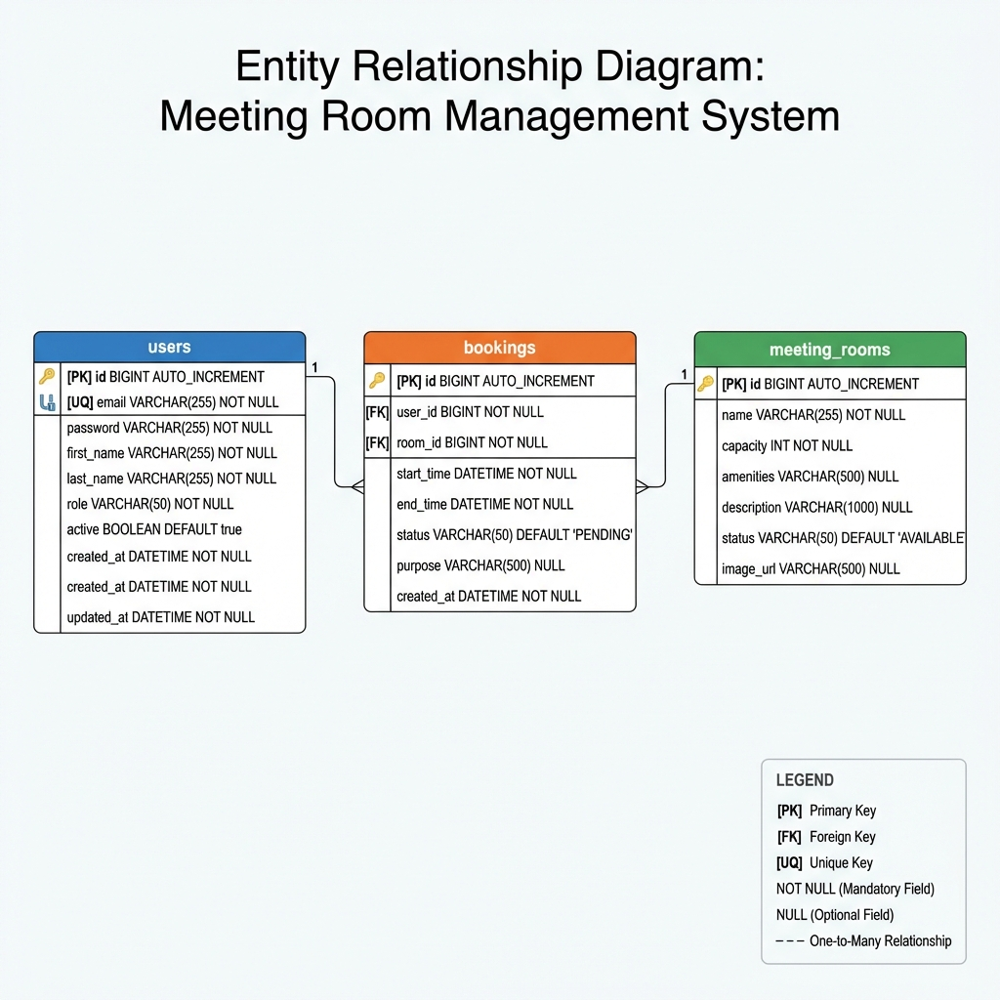
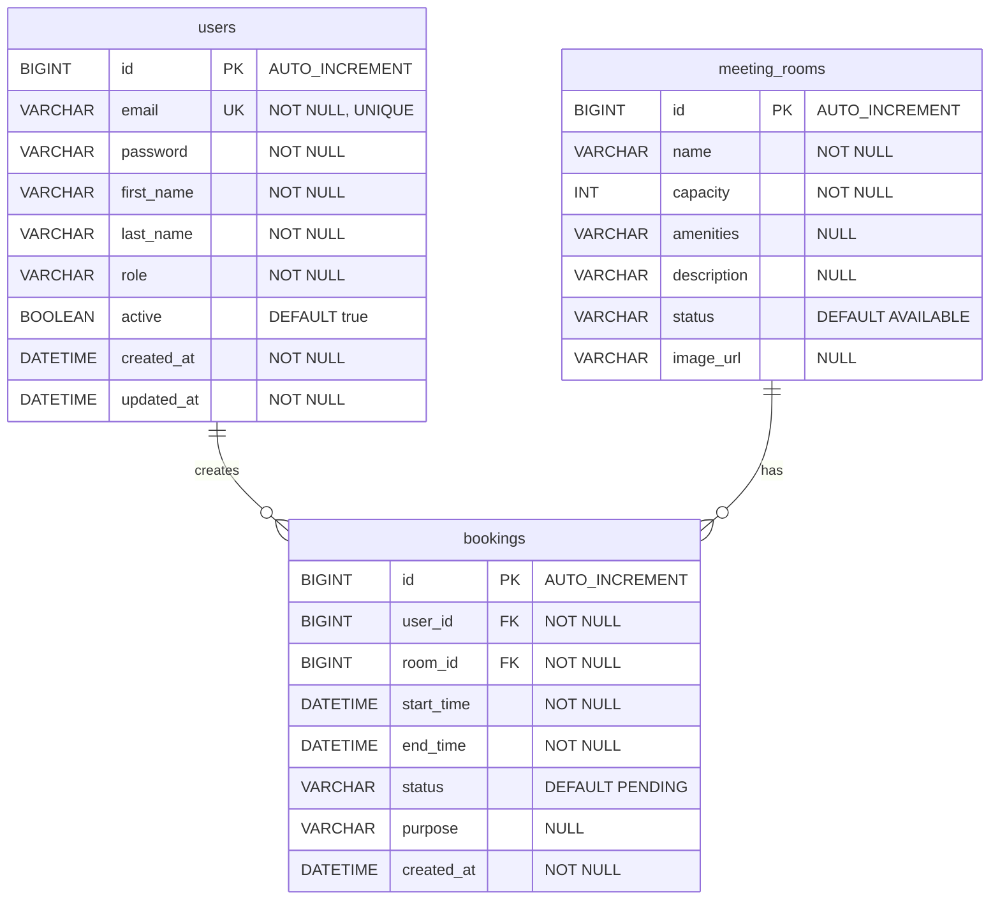

# Entity Relationship Diagram
## Meeting Room Management System

---

## Database Overview

| Property | Value |
|----------|-------|
| **Database** | MySQL 8.0 |
| **Total Tables** | 3 |
| **Character Set** | UTF-8 |
| **Collation** | utf8mb4_unicode_ci |

---

## ER Diagram



---

## Tables Structure

### 1. users

> Stores user account information including authentication credentials and profile data.

| # | Field Name | Data Type | Constraints | Default | Description |
|---|------------|-----------|-------------|---------|-------------|
| 1 | id | BIGINT(20) | PRIMARY KEY, AUTO_INCREMENT | - | Unique user identifier |
| 2 | email | VARCHAR(255) | UNIQUE, NOT NULL | - | User email address (login) |
| 3 | password | VARCHAR(255) | NOT NULL | - | Encrypted password (BCrypt) |
| 4 | first_name | VARCHAR(255) | NOT NULL | - | User's first name |
| 5 | last_name | VARCHAR(255) | NOT NULL | - | User's last name |
| 6 | role | VARCHAR(50) | NOT NULL | - | User role (USER/ADMIN) |
| 7 | active | BOOLEAN | NOT NULL | true | Account status flag |
| 8 | created_at | DATETIME | NOT NULL | CURRENT_TIMESTAMP | Account creation time |
| 9 | updated_at | DATETIME | NOT NULL | CURRENT_TIMESTAMP | Last update time |

**Indexes:**
- `PRIMARY` on `id`
- `UK_email` (UNIQUE) on `email`

---

### 2. meeting_rooms

> Stores meeting room information including capacity, amenities, and availability status.

| # | Field Name | Data Type | Constraints | Default | Description |
|---|------------|-----------|-------------|---------|-------------|
| 1 | id | BIGINT(20) | PRIMARY KEY, AUTO_INCREMENT | - | Unique room identifier |
| 2 | name | VARCHAR(255) | NOT NULL | - | Meeting room name |
| 3 | capacity | INT(11) | NOT NULL | - | Maximum occupancy |
| 4 | amenities | VARCHAR(500) | NULL | NULL | Comma-separated amenities |
| 5 | description | VARCHAR(1000) | NULL | NULL | Room description |
| 6 | status | VARCHAR(50) | NOT NULL | 'AVAILABLE' | Room status |
| 7 | image_url | VARCHAR(500) | NULL | NULL | Room image URL |

**Indexes:**
- `PRIMARY` on `id`

**Status Values:**
- `AVAILABLE` - Room is available for booking
- `MAINTENANCE` - Room is under maintenance

---

### 3. bookings

> Stores booking records linking users to meeting rooms with time slots and approval status.

| # | Field Name | Data Type | Constraints | Default | Description |
|---|------------|-----------|-------------|---------|-------------|
| 1 | id | BIGINT(20) | PRIMARY KEY, AUTO_INCREMENT | - | Unique booking identifier |
| 2 | user_id | BIGINT(20) | FOREIGN KEY, NOT NULL | - | Reference to users.id |
| 3 | room_id | BIGINT(20) | FOREIGN KEY, NOT NULL | - | Reference to meeting_rooms.id |
| 4 | start_time | DATETIME | NOT NULL | - | Booking start time |
| 5 | end_time | DATETIME | NOT NULL | - | Booking end time |
| 6 | status | VARCHAR(50) | NOT NULL | 'PENDING' | Booking status |
| 7 | purpose | VARCHAR(500) | NULL | NULL | Meeting purpose |
| 8 | created_at | DATETIME | NOT NULL | CURRENT_TIMESTAMP | Booking creation time |

**Indexes:**
- `PRIMARY` on `id`
- `FK_user_id` on `user_id`
- `FK_room_id` on `room_id`
- `IDX_start_time` on `start_time`
- `IDX_status` on `status`

**Status Values:**
- `PENDING` - Awaiting admin approval
- `CONFIRMED` - Approved by admin
- `CANCELLED` - Cancelled by user
- `REJECTED` - Rejected by admin
- `COMPLETED` - Meeting completed

---

## Relationships

### One-to-Many Relationships

```
┌─────────────┐         ┌─────────────┐         ┌─────────────┐
│   users     │         │  bookings   │         │meeting_rooms│
├─────────────┤         ├─────────────┤         ├─────────────┤
│ PK: id      │───1:N──▶│ FK: user_id │         │ PK: id      │
│             │         │ FK: room_id │◀──1:N───│             │
└─────────────┘         └─────────────┘         └─────────────┘
```

| Relationship | Parent Table | Child Table | Type | Description |
|--------------|--------------|-------------|------|-------------|
| 1 | users | bookings | One-to-Many | One user can create multiple bookings |
| 2 | meeting_rooms | bookings | One-to-Many | One room can have multiple bookings |

---

## Mermaid ER Diagram



---

## Foreign Key Constraints

| Constraint Name | Table | Column | References | On Delete | On Update |
|-----------------|-------|--------|------------|-----------|-----------|
| FK_booking_user | bookings | user_id | users(id) | CASCADE | CASCADE |
| FK_booking_room | bookings | room_id | meeting_rooms(id) | CASCADE | CASCADE |

---

## Cardinality Summary

| Relationship | Cardinality | Explanation |
|--------------|-------------|-------------|
| users ↔ bookings | 1:N | A user can have 0 or more bookings. Each booking belongs to exactly 1 user. |
| meeting_rooms ↔ bookings | 1:N | A room can have 0 or more bookings. Each booking is for exactly 1 room. |

---

## Business Rules

1. **User Authentication**
   - Email must be unique across all users
   - Password is stored encrypted (BCrypt hash)
   - Users can have role `USER` or `ADMIN`

2. **Room Management**
   - Room names should be descriptive and unique
   - Capacity must be a positive integer
   - Rooms under `MAINTENANCE` cannot be booked

3. **Booking Rules**
   - `start_time` must be before `end_time`
   - `start_time` cannot be in the past
   - Cannot book a room that is already booked for overlapping time
   - New bookings default to `PENDING` status
   - Only `ADMIN` can approve or reject bookings

---

## Data Dictionary

### Enum Values Reference

#### users.role
| Value | Description |
|-------|-------------|
| USER | Regular user with booking privileges |
| ADMIN | Administrator with management privileges |

#### users.active
| Value | Description |
|-------|-------------|
| true | Account is active and can login |
| false | Account is deactivated |

#### meeting_rooms.status
| Value | Description |
|-------|-------------|
| AVAILABLE | Room is available for booking |
| MAINTENANCE | Room is under maintenance |

#### bookings.status
| Value | Description |
|-------|-------------|
| PENDING | Awaiting admin approval |
| CONFIRMED | Booking approved |
| CANCELLED | Cancelled by user |
| REJECTED | Rejected by admin |
| COMPLETED | Meeting has ended |

---

## SQL Schema

```sql
-- Create users table
CREATE TABLE users (
    id BIGINT AUTO_INCREMENT PRIMARY KEY,
    email VARCHAR(255) NOT NULL UNIQUE,
    password VARCHAR(255) NOT NULL,
    first_name VARCHAR(255) NOT NULL,
    last_name VARCHAR(255) NOT NULL,
    role VARCHAR(50) NOT NULL,
    active BOOLEAN NOT NULL DEFAULT true,
    created_at DATETIME NOT NULL DEFAULT CURRENT_TIMESTAMP,
    updated_at DATETIME NOT NULL DEFAULT CURRENT_TIMESTAMP ON UPDATE CURRENT_TIMESTAMP
);

-- Create meeting_rooms table
CREATE TABLE meeting_rooms (
    id BIGINT AUTO_INCREMENT PRIMARY KEY,
    name VARCHAR(255) NOT NULL,
    capacity INT NOT NULL,
    amenities VARCHAR(500),
    description VARCHAR(1000),
    status VARCHAR(50) NOT NULL DEFAULT 'AVAILABLE',
    image_url VARCHAR(500)
);

-- Create bookings table
CREATE TABLE bookings (
    id BIGINT AUTO_INCREMENT PRIMARY KEY,
    user_id BIGINT NOT NULL,
    room_id BIGINT NOT NULL,
    start_time DATETIME NOT NULL,
    end_time DATETIME NOT NULL,
    status VARCHAR(50) NOT NULL DEFAULT 'PENDING',
    purpose VARCHAR(500),
    created_at DATETIME NOT NULL DEFAULT CURRENT_TIMESTAMP,
    CONSTRAINT FK_booking_user FOREIGN KEY (user_id) REFERENCES users(id) ON DELETE CASCADE,
    CONSTRAINT FK_booking_room FOREIGN KEY (room_id) REFERENCES meeting_rooms(id) ON DELETE CASCADE
);

-- Create indexes for performance
CREATE INDEX IDX_booking_start_time ON bookings(start_time);
CREATE INDEX IDX_booking_status ON bookings(status);
CREATE INDEX IDX_booking_user ON bookings(user_id);
CREATE INDEX IDX_booking_room ON bookings(room_id);
```

---

## Legend

| Symbol | Meaning |
|--------|---------|
| PK | Primary Key |
| FK | Foreign Key |
| UK | Unique Key |
| NOT NULL | Mandatory field |
| NULL | Optional field |
| \|\|--o{ | One-to-Many relationship |

---

**Document Version:** 1.0  
**Last Updated:** January 18, 2026  
**Author:** Ayush Maheshwari
